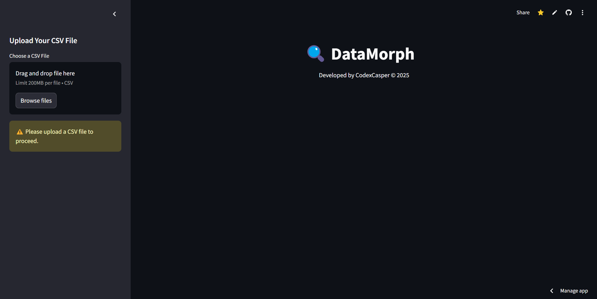
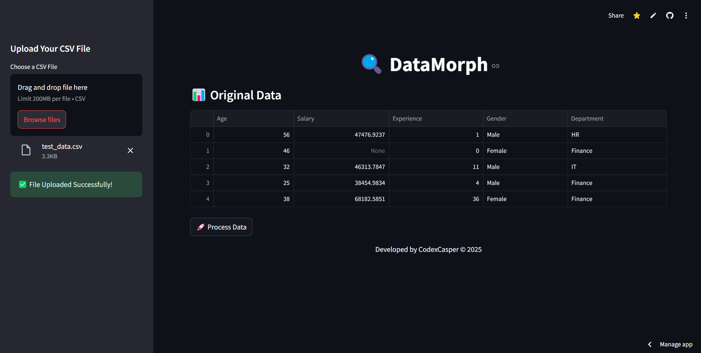
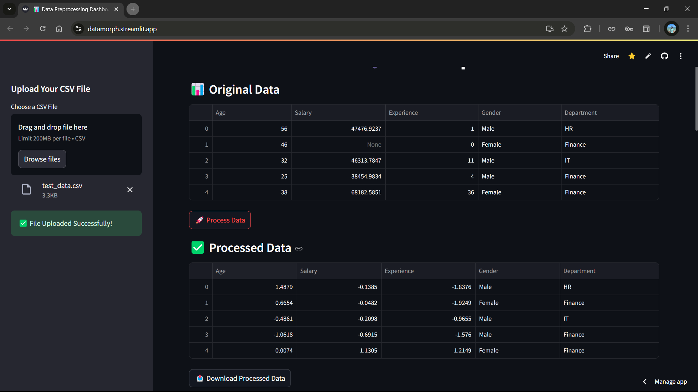
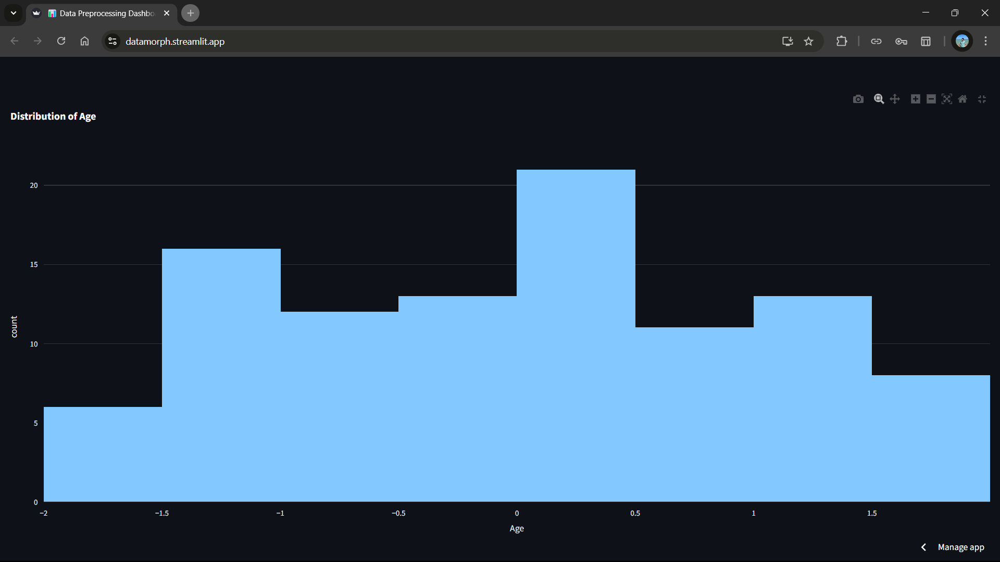
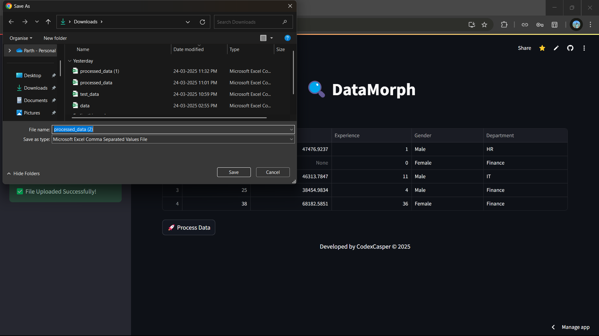

# 🔍 DataMorph - Data Preprocessing & Visualization Tool

🚀 **An AI-powered tool for seamless data cleaning, preprocessing, and visualization.** 

Effortlessly **upload, clean, visualize, and download** preprocessed datasets, making machine learning pipelines smoother.

## Acknowledgements

Special thanks to the **open-source community** and the developers of the following libraries that made this project possible:

- [Pandas](https://pandas.pydata.org/) – Efficient data manipulation and analysis
- [NumPy](https://numpy.org/) – Numerical computations
- [Scikit-learn](https://scikit-learn.org/) – Data preprocessing and machine learning utilities
- [Seaborn](https://seaborn.pydata.org/) – Statistical data visualization
- [Matplotlib](https://matplotlib.org/) – Graph plotting
- [Plotly](https://plotly.com/) – Interactive visualizations
- [Streamlit](https://streamlit.io/) – Easy-to-use framework for data apps

A huge thanks to the **open-source contributors** whose work helped shape this tool! 🚀

## Deployment

🌐 **Live Demo**: 

## Authors

👤 Parth Bindal

📧 parth.23mip10104@vitbhopal.ac.in

🔗 https://www.linkedin.com/in/parth-bindal/

🔗 https://github.com/CodexCasper

## Features

✅ **Upload & Process CSV Files** – Users can upload CSV files, and the tool automatically cleans, preprocesses, and transforms the data.  

📊 **Data Visualization** – Generate interactive visualizations, including **histograms, scatter plots, and correlation heatmaps** using **Seaborn** and **Plotly**.  

🛠️ **Outlier Detection & Handling** – Uses the **Interquartile Range (IQR) method** to detect and handle outliers.  

📉 **Missing Value Handling** – Automatically fills missing values using **median** for numeric columns and **mode** for categorical columns.  

⚡ **Data Normalization** – Scales numeric features using **StandardScaler** for better model performance.  

📥 **Download Processed Data** – Users can download the cleaned and preprocessed data in CSV format.  

🎨 **Modern & Responsive UI** – Built with **Streamlit**, ensuring a smooth, interactive, and user-friendly experience.  

📡 **Live Deployment** – Hosted on **Streamlit Cloud**, allowing real-time access from any device.  

## License

This project is licensed under the **MIT License** – see the [LICENSE](./LICENSE) file for details.  

## 📸 Screenshots

### Home Page

### Data Upload

### Processed Data

### Data Visualization

### Download Processed Data

